## Bersermovil

Bersermovil es una nueva operadora de telecomunicaciones el cual requiere de un sistema que provea el servicio de atención al cliente mediante llamadas al *555#. Cuando se realiza una llamada se abrira un menu donde saldran multiples opciones que el usuario podrá elegir.

## El sistema debe tener lo siguiente

- Muestra un menú principal donde se enviara la opción requerida.
- Se debe tener una base de números de telefonos definidos, los cuales deben tener un estado de activo o inactivo. 
    
    - Inactivo: El menu que se abre es para activar el numero, en este caso se pedira la información del usuario: nombres, apellidos, número de cedula.
    - Activo: En este estado se abrira el menu principal.

- La información debe almacenarse en una base de datos.
- Debe validar los datos de entrada.

## Clases

**Numeros:**
 
- id_numero 
- id_persona
- id_saldo
- numero_telefono
- estado

**Personas**

- id_persona
- nombre
- apellido
- cedula

**Paquetes**

- id_paquete
- descripcion
- id_saldo

**Bancos**

- id_banco
- nombre_banco

**CuentaBancaria**

- id_cuenta_bancaria
- id_banco
- id_persona
- tipo: (ahorro, corriente)
- tarjeta_debito
- clave

## Menú principal
1. Menu inicial

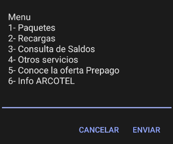

1.1. Paquetes

1.2. Recargas

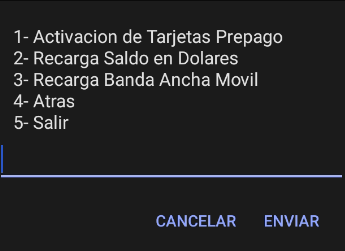

1.2.1. Activación de tarjeta

1.2.2. Recarga de saldo en dolares

1.2.2.1. Elegir banco

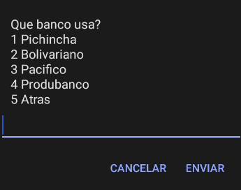

- numero de cedula
- clave
- ultimos digitos de la tarjeta de debito

1.3. Consulta de saldo

1.3.1. 

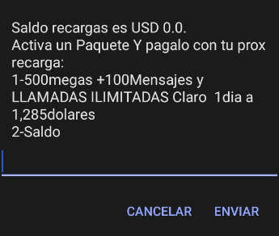

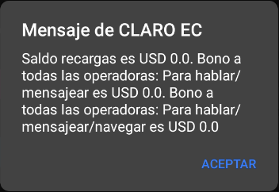

1.3.2. 

1.3.2.1.

nos envia al 1.3.2.

1.3.2.2.

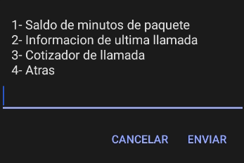

1.3.2.2.1.

1.3.2.2.1.1.

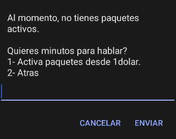

1.3.2.2.2.

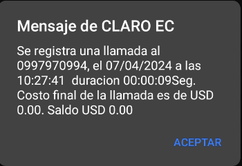

1.4.

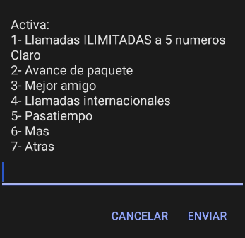

1.5.

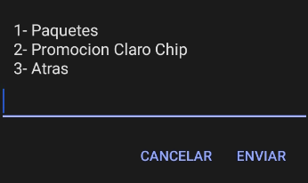

1.5.1.

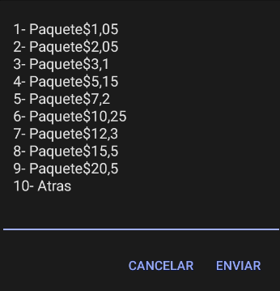

1.5.1.1.

1.5.2.

1.6.

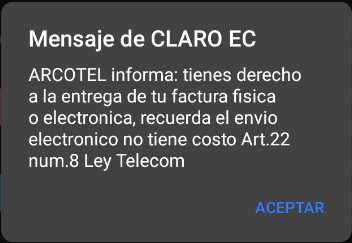

